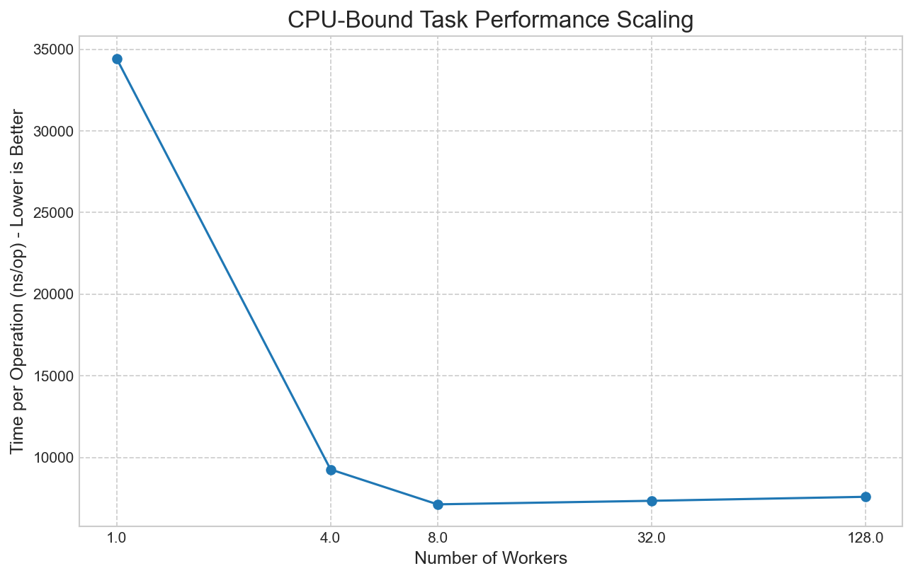
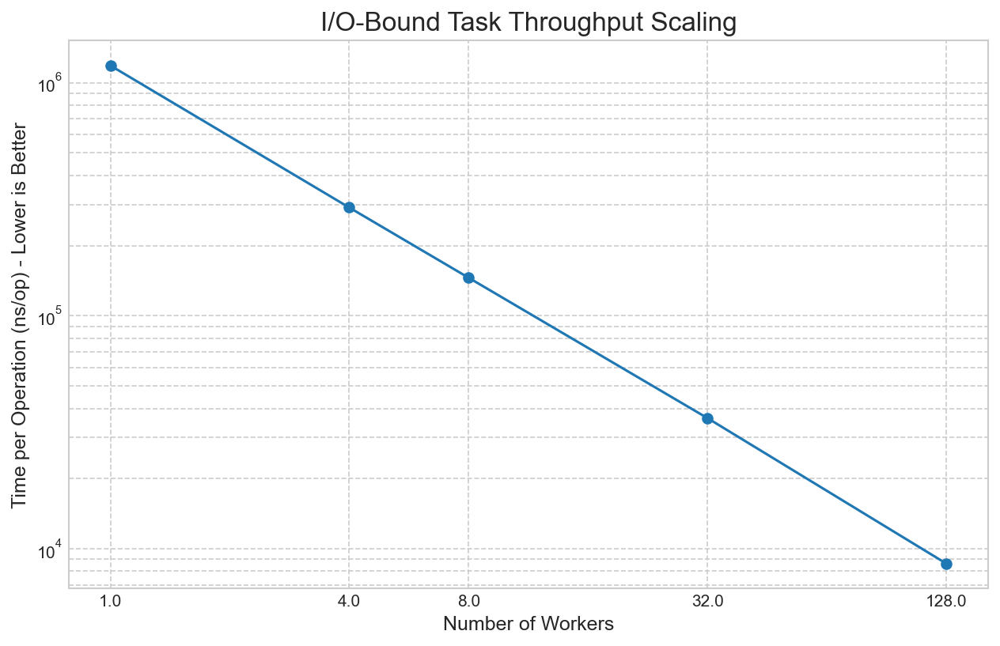
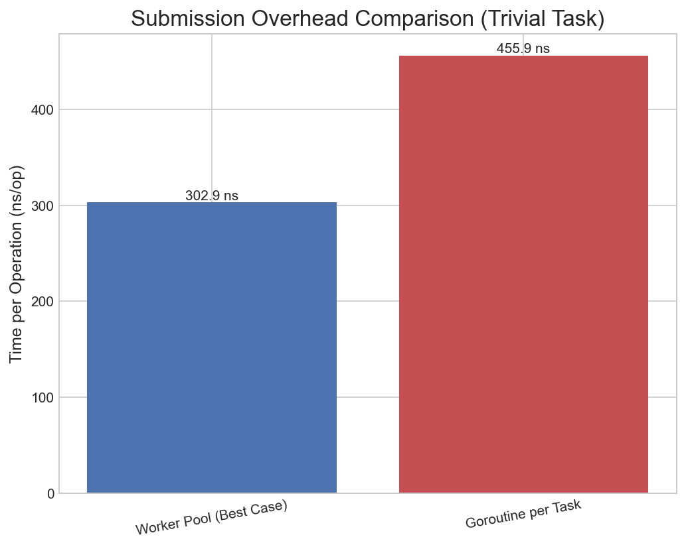

# High-Performance, Zero-Allocation Go Worker Pool

[](https://github.com/GregoryKogan/worker-pool/actions/workflows/go.yml)

[](https://goreportcard.com/report/github.com/GregoryKogan/worker-pool)
[](https://pkg.go.dev/github.com/GregoryKogan/worker-pool)
[](https://opensource.org/licenses/MIT)

---

A robust, idiomatic, and production-ready worker pool for Go that provides fine-grained control over concurrency with a focus on high performance and zero-allocation submissions.

Managing a large number of concurrent tasks efficiently can be complex. Spawning an unbounded number of goroutines can lead to resource exhaustion and performance degradation due to scheduler overhead. This worker pool provides a simple, robust, and extremely fast way to control concurrency, process task queues, and manage graceful shutdowns, all while avoiding common pitfalls like deadlocks and race conditions.

## Features

- **Zero-Allocation `Submit`:** The hot path for submitting tasks is allocation-free, minimizing GC pressure in high-throughput applications.
- **Automatic Backpressure:** The pool naturally applies backpressure when all workers are saturated, preventing unbounded queue growth and system overload.
- **Graceful vs. Abrupt Shutdown:** Choose between two shutdown strategies: `StopWait()` to finish all queued tasks, or `Stop()` to terminate quickly, completing only in-flight tasks.
- **Concurrency Safe:** Designed from the ground up to be safe for concurrent use and rigorously tested with the Go race detector.
- **100% Test Coverage:** Every line of code is covered by deterministic unit and integration tests, ensuring reliability.

## Performance Highlights

This library is built for speed. Benchmarks are conducted on an **Apple M1 Pro** with **8 performance cores**. The results demonstrate superior performance compared to naive goroutine spawning and showcase excellent scaling characteristics.

### CPU-Bound Scaling

For CPU-bound tasks, the pool exhibits near-perfect linear scaling up to the number of available CPU cores, after which performance correctly plateaus. This demonstrates efficient core utilization without the overhead of excessive context switching.



### I/O-Bound Scaling

For I/O-bound tasks (e.g., network requests, disk I/O), the pool demonstrates massive throughput gains as the number of workers increases. This is ideal for managing a large number of concurrent, non-blocking operations.



### Submission Overhead vs. `go func()`

The primary goal of a worker pool is to amortize the cost of goroutine management. For high-throughput, short-lived tasks, the pool's submission overhead is significantly lower than the native `go func()` approach, thanks to its zero-allocation design.



## Installation

```sh
go get github.com/GregoryKogan/worker-pool
```

## Usage

### Quick Start

Here is a simple example of creating a pool, submitting work, and shutting it down gracefully.

```go
package main

import (
 "fmt"
 "runtime"
 "sync/atomic"
 "time"

 "github.com/<YOUR_USERNAME>/<YOUR_REPOSITORY>"
)

func main() {
 // Create a pool with a number of workers equal to the number of CPUs.
 pool := worker_pool.NewWorkerPool(runtime.NumCPU())

 var tasksCompleted atomic.Int64
 numTasks := 100

 // Submit 100 tasks to the pool.
 for i := 0; i < numTasks; i++ {
  taskID := i // Capture the loop variable
  pool.Submit(func() {
   fmt.Printf("Processing task %d...\n", taskID)
   time.Sleep(10 * time.Millisecond)
   tasksCompleted.Add(1)
  })
 }

 fmt.Println("All tasks submitted. Waiting for completion...")

 // Stop the pool and wait for all queued tasks to complete.
 pool.StopWait()

 fmt.Printf("All %d tasks have been completed.\n", tasksCompleted.Load())
}
```

### API Overview

- **`NewWorkerPool(numberOfWorkers int) *WorkerPool`**  
    Creates and starts a new worker pool with the specified number of workers. Panics if `numberOfWorkers < 1`.

- **`Submit(task func())`**  
    Adds a task to the pool for asynchronous execution. This is a non-blocking, zero-allocation call.

- **`SubmitWait(task func())`**  
    Adds a task to the pool and blocks until that specific task is completed.

### Graceful Shutdown

The library provides two distinct shutdown methods to handle different application needs.

- **`Stop()`**  
    Initiates an **abrupt shutdown**. It signals all workers to stop after they finish their *currently executing* task. Any tasks waiting in the queue are discarded. This is useful for quick teardowns where pending work can be ignored.

- **`StopWait()`**  
    Initiates a **graceful shutdown**. The pool first stops accepting new tasks and then waits for all existing tasks—both those currently running and those waiting in the queue—to be completed before stopping the workers. This is the most common method for ensuring no work is lost.

## Development & Benchmarking

This project is fully tested and benchmarked. You can run these commands yourself.

**1. Run Tests:**  
The test suite is designed to be run with the race detector to ensure concurrency safety.

```sh
go test -v -race ./...
```

**2. Generate Benchmark Data:**  
To reproduce the performance benchmarks, run the following command. The `-json` flag is required for the visualization script.

```sh
# Ensure the output directory exists
mkdir -p results/benchmarks

# Run benchmarks and save the machine-readable output
go test -bench=. -benchmem -benchtime=3s -json > results/benchmarks/latest.json
```

**3. Visualize Benchmark Results:**  
The `scripts/` directory contains a Python script to generate the performance plots.

```sh
# (One-time setup) Create and activate a virtual environment
python3 -m venv scripts/.venv
source scripts/.venv/bin/activate
pip install -r scripts/requirements.txt

# Generate plots from the latest benchmark data
python3 scripts/plot_benchmarks.py --input results/benchmarks/latest.json
```

## Contributing

Contributions are welcome! Please feel free to open an issue to discuss a feature or bug, or submit a pull request with your changes.

## License

This project is licensed under the MIT License. See the [LICENSE](LICENSE) file for details.
